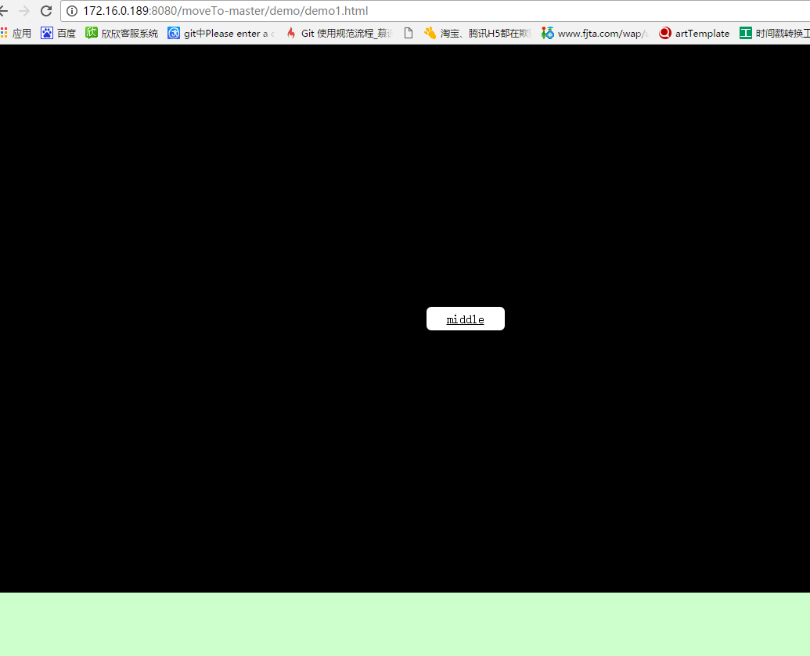
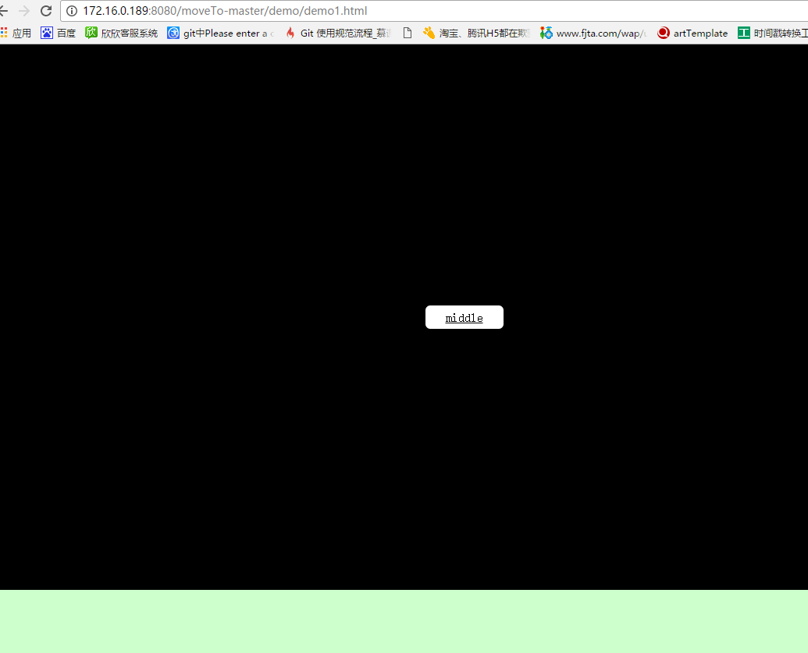

# 无依赖的页面滚动动画


看到这个效果，我想作为一个前端一定不吃惊，这不就是锚点吗，在a标签的href属性中添加写上对应的dom的id，页面就会飞到对应的id，没啥动画，十分突兀，用户体验不怎么样~（我还记得大二学了知识点，觉得自己很牛逼~尴尬）。身为一个前端，唉，我还是说自己是个切图的把，我们肯定希望效果是这样的：

可能有的小伙伴会说这不难呀，jQuery里有个scrollTop()就能做到啊，的确，不过如果你不知道滚动的距离呢，或者项目不能用jQuery呢~是不是有点力不从心了~不要紧，这里有个轻便的js滚动动画库帮你解决 [MoveTo](https://github.com/hsnaydd/moveTo "MoveTo")。先来看看我的CSS样式和HTML结构。
CSS：
``` HTML
<style type="text/css">
        html, body, div {
            margin: 0;
            padding: 0;
        }
        .section1 {
            position: relative;
            width: 100%;
            height: 700px;
            background: #000;
        }
        .section2 {
            position: relative;
            width: 100%;
            height: 700px;
            background: #cfc;
        }
        .section3 {
            position: relative;
            width: 100%;
            height: 700px;
            background: #ccc;
        }
        .btn {
            position: absolute;
            top: 0;
            left: 0;
            right: 0;
            bottom: 0;
            width: 100px;
            height: 30px;
            margin: auto;
            line-height: 30px;
            background: #fff;
            border-radius: 6px;
            text-align: center;
            color: #000;
            cursor: pointer;
        }
    </style>
```
HTML：
``` html
    <div class="section1" id="top">
        <a class="btn" href="#middle">middle</a>   
    </div>
    <div class="section2" id="middle">
        <a class="btn" href="#bottom">bottom</a>
    </div>
    <div class="section3" id="bottom">
        <a class="btn" href="#top">top</a> 
    </div>
```
接下来就是知道怎么使用它了。
``` javascript
//先实例化这个函数
     var moveTo = new MoveTo();
     var target = document.getElementById("down");
     moveTo.move(target); // 可以是对象，滚动距离为当前对象距离顶部的位置。（这样直接滚动到id为down所在的位置）
     moveTo.move(300); // 可以是number，滚动位移位数字的大小，超出页面高度，则滚动到最底部。（这样页面滚动300px的距离）
```
如果页面上有多个元素需要绑定
``` javascript
    var triggers = document.getElementsByClassName('btn');
    for(var i = 0; i < trigger.length; i++) {
        moveTo.registerTrigger(trigger[i]);//这个要和a标签一起用或者使用 data-target="#target" 比较好，a标签中的href写id是一个锚点连接，点击的话他会直接到这个id所对应的盒模型，没有滚动的过渡效果，当然你也可以不在a标签href写值或者不给 data-target 赋值，那他就会滚动到第一个元素。
    };
```
MoveTo()带有四个参数，<br />tolerance 允许的容差，也就是比如你设置了100，那就会停留在目标元素位置减去100的地方。<br />duration 滚动到目标元素所用的时间（毫秒为单位）。<br />easing 自定义滚动效果，自定义滚动效果的名字。<br />callback 回调函数，在滚动结束后执行。像这样。
```javascript
    new MoveTo({
      tolerance: 0,
      duration: 800,
      easing: 'easeOutQuart'
    })
```
自定义滚动函数的用法
```javascript
    document.addEventListener('DOMContentLoaded', function () {
        var easeFunctions = {
            //t为每次滚动的开始时间，b是滚动开始的位置，c为目标的位置也就是变化量，d为滚动的时间，然后return出对应的距离，把距离给window.scroll(0,这个值)进行滚动，看到window对象，就以为着他的父元素只能是body了~（我原本想用他做一个横向移动的东西~），而且scroll(x,y)这个函数只能支持有滚动条状态下的移动（我原本想做一个点击横向滚动ppt类型的动画~又失败了），这里要特别说明的是他的滚动不是我们以往用的计时器加offset或者是CSS3 transition或animation，他使用了requestAnimationFrame()这个鲜有人问津的函数。稍后，我们简单的说下这个函数。
            easeInQuad: function (t, b, c, d) {
                t /= d;
                return c * t * t + b;
            },
            easeOutQuad: function (t, b, c, d) {
                t /= d;
                return -c * t* (t - 2) + b;
            }
        }   
        //Quadratic：二次方的缓动（t^2）
        //Cubic：三次方的缓动（t^3）
        //Quartic：四次方的缓动（t^4）
        //Quintic：五次方的缓动（t^5）
        //Sinusoidal：正弦曲线的缓动（sin(t)）
        //Exponential：指数曲线的缓动（2^t）
        //Circular：圆形曲线的缓动（sqrt(1-t^2)）
        //Elastic：指数衰减的正弦曲线缓动
        //但是并不是所有都能用，还要配合duration属性，这点就和数学有关了，如果你提供的缓动和duration计算出来会无限趋于1，那可能就会造成无法滚动~（这里我就把自己给坑了，想了一个晚上为啥我写的函数不能滚动。虽说当年我物理曾经拿过全市前200名，当然参加都是全市的高中顶尖学生，很惨的是总人数就200~尴尬）。
        var moveTo = new MoveTo({
            duration: 1000,
            easing: 'easeInQuad'
        }, easeFunctions);
        var trigger = document.getElementsByClassName('btn')[0];
        moveTo.registerTrigger(trigger);
    });
```
### 接下来我们来谈谈requestAnimationFrame：
有挺多浏览器的显示屏率是16.7ms，也就比如一条公路最快速度16.7ms通过一辆车，在33.4ms才能通过第二辆车。但是有得人就喜欢挤上去非要23ms使用了setInterval进行夹塞，要想安全通过，只能让第一辆车消失，也就是丢帧，就给人一种动画卡顿的感觉。requestAnimationFrame就是跟着浏览器的绘制走，浏览器最快绘制速度是多少，那他就是多少，动画就不会掉帧，自然的流畅。

###最后
MoveTo虽然不能作出很牛逼的效果，而且兼容性有点尴尬，但是他的源码确实给我们提供了另外一种绘制动画的方式。如果只是做简单的页面滚动，不妨尝试使用这个~
